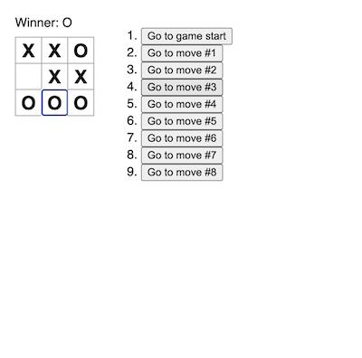

# README

## Description

These are the local files I created while following the React.dev tutorial [Tic-Tac-Toe](https://react.dev/learn/tutorial-tic-tac-toe).

I created the project from scratch using Vite instead of the in-browser development environment. There were only a handful of CSS styles to copy from the sandbox files download into my new project.

The tutorial was well written and easy to follow. The tutorial was more about game mechanics than React concepts, but that's an effective way to introduce people to it. I'm impressed by the overall quality of all the documentation on the React website.

I plan to circle back to this tutorial and make the enhancements it suggests in the final section. In addition I would like to:

- Report when the game ends in a tie
- Add a button that clears the move history and resets the game

## Technologies used

- JavaScript
- Vite
- React 4

## Create Vite app

```sh
cd ~/Dev
npm create vite@latest react_tic_tac_toe
```

- Install `create-vite@8.1.0`
- Framework: React
- Variant: JavaScript
- Use rolldown-vite: No
- Install with npm and start now? No

## Run project

```sh
cd react_tic_tac_toe
npm install
npm run dev
```

## Project setup

Changed port to 3000 in `vite.config.js`:

```js
export default defineConfig({
  plugins: [react()],
  server: {
    port: 3000,
  },
});
```

Copied default Vite project assets, HTML, CSS into `old` folders and cleared out code for new project:

- src/App.css
- src/App.jsx
- src/index.css

Downloaded tutorial sandbox by following instructions at [Setup for the Tutorial](https://react.dev/learn/tutorial-tic-tac-toe#setup-for-the-tutorial)

Replaced `index.css` with sandbox CSS

## Screenshot


